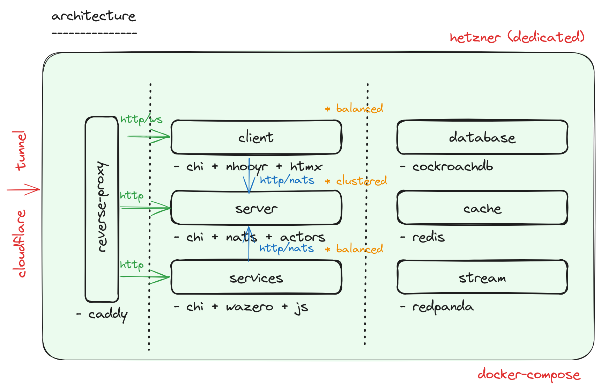

# xtox

Let's develop together.

## setup

please install the following tools

- [golang](https://go.dev)
- [bun](https://bun.sh)
- [docker-engine](https://docs.docker.com/engine)

## structure

general structure and architecture

- [client](./client/README.md)      : responsible for `frontend (web)`
- [server](./server/README.md)      : responsible for `backend`
- [services](./services/README.md)  : responsible for `lambda`



## development
please run below to open project in [vscode](https://code.visualstudio.com/)

```bash
go work init
go work use client
go work use server
go work use services
```

> `go` best practices advises not to commit `go.work` files to `git`

please run below to start/stop platform using `docker-compose`

```bash
make create-network # start the network (only once)
make start          # start the platform
make watch          # start the platform and watch changes 
make stop           # stop the platform

make delete-network # delete network
make delete-data    # delete data

make logs           # check docker logs
```

> use `make start` or `make watch`
> you can run `make logs` to see all logs you can run `docker ps -a && docker logs {id}` to see instance logs
